Berikut adalah beberapa ringkasan materi yang saya buat mengenai Docker:

1. Docker adalah platform open-source untuk mengembangkan, mengirim, dan menjalankan aplikasi dalam wadah terisolasi, yang disebut kontainer.

2. Kontainer Docker memungkinkan pengembang untuk memisahkan aplikasi dari lingkungan hosting dan infrastruktur, memungkinkan aplikasi untuk berjalan dengan konsisten di berbagai lingkungan.

3. Docker memungkinkan pengembang untuk mengemas semua dependensi aplikasi, termasuk sistem operasi, perpustakaan, dan kode aplikasi, ke dalam satu wadah yang dapat diinstal dan dijalankan di berbagai lingkungan.

4. Docker menggunakan file konfigurasi yang disebut Dockerfile untuk mengatur dan membangun kontainer. Dockerfile berisi instruksi untuk menambahkan dependensi aplikasi, memetakan port, dan menentukan entri point untuk menjalankan aplikasi.

5. Docker memiliki command-line interface (CLI) yang kuat, yang memungkinkan pengembang untuk membangun, menjalankan, dan mengelola kontainer dengan mudah.

6. Docker memiliki fitur jaringan dan penyimpanan terpisah, yang memungkinkan pengembang untuk membuat jaringan dan penyimpanan terisolasi untuk kontainer.

7. Docker menyediakan layanan orchestrasi yang memungkinkan pengembang untuk mengelola dan menyebarkan kontainer pada berbagai host dan lingkungan.

8. Docker memiliki ekosistem yang kaya dengan banyak alat dan layanan, termasuk Docker Compose untuk mengelola kontainer, Docker Swarm untuk orchestrasi, dan Docker Hub untuk berbagi dan menyimpan kontainer.

9. Docker dapat membantu pengembang mempercepat waktu pengembangan, meningkatkan portabilitas aplikasi, dan mengurangi biaya infrastruktur.

10. Docker dapat digunakan pada berbagai macam proyek, dari proyek kecil hingga proyek besar dan kompleks, dan pada berbagai lingkungan, termasuk lingkungan pengembangan, pengujian, dan produksi.

## Praktikum - Docker & AWS Compute Service

---

1.  Melakukan konfigurasi EC2

    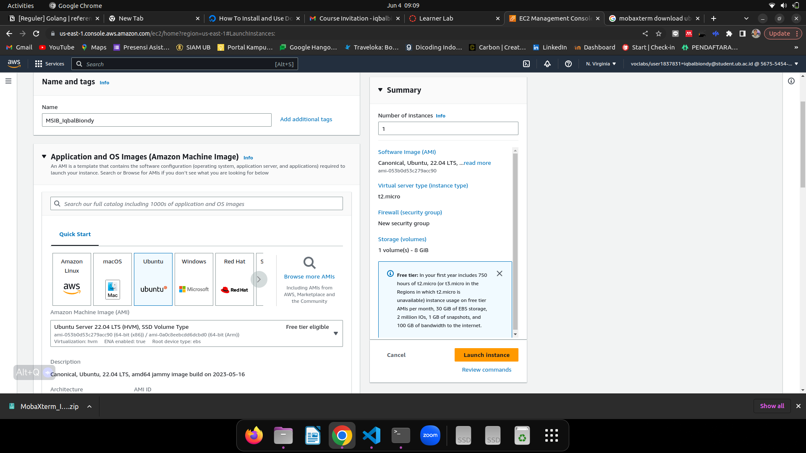

2.  Membuat Create Key Pair

    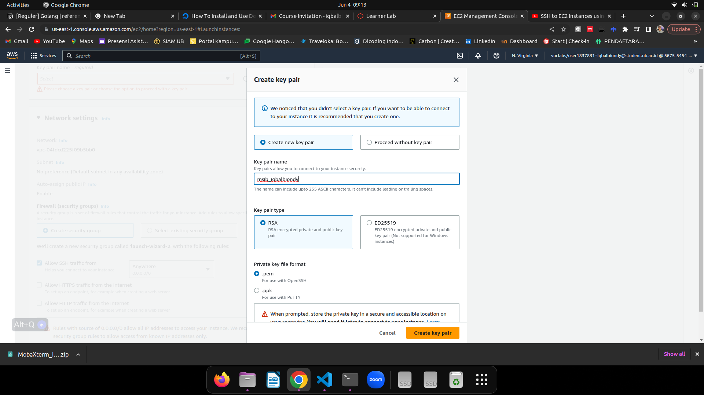

3.  Menyetting Network Setting

    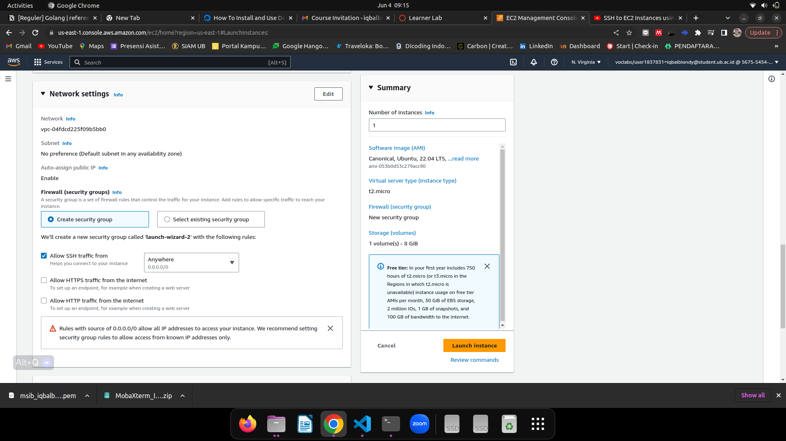

4.  EC2 Instance berhasil dibuat

    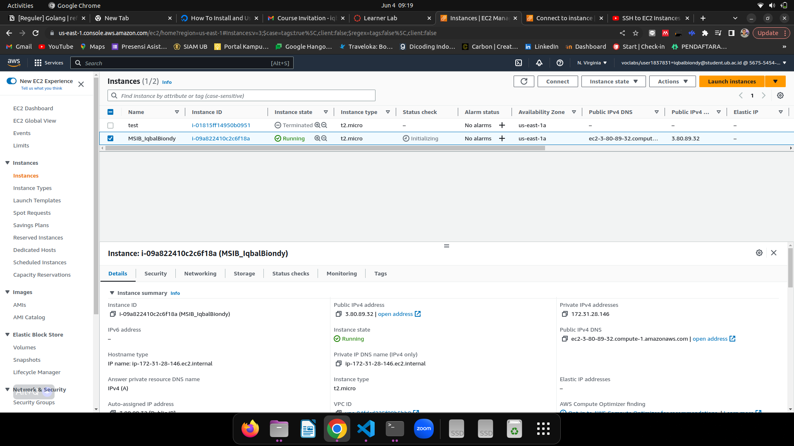

5.  mengkoneksi _instance EC2_ dari lokal komputer

    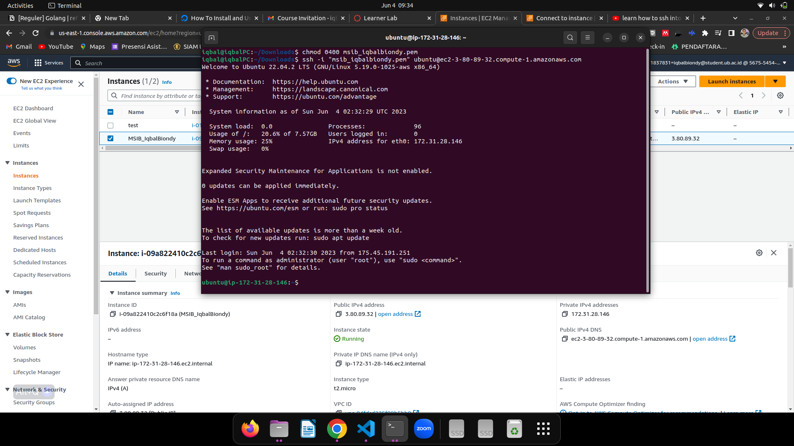

6.  melakukan instalasi docker

    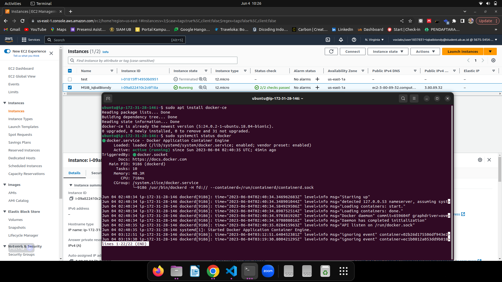

7.  melakukan instalasi & konfigurasi docker compose

    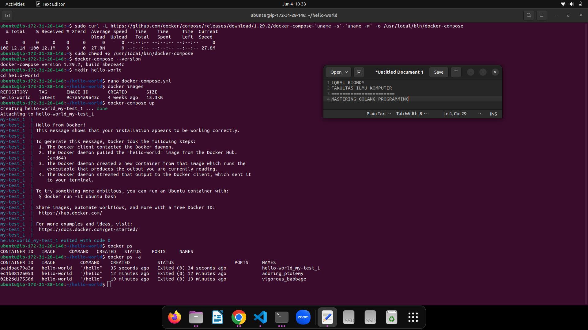

8.  melakukan clonning github ke instance EC2

    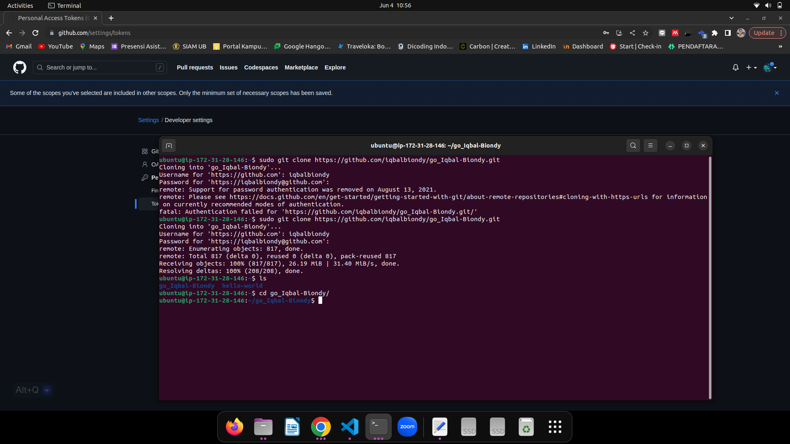

9.  Melakukan Build Docker Image

    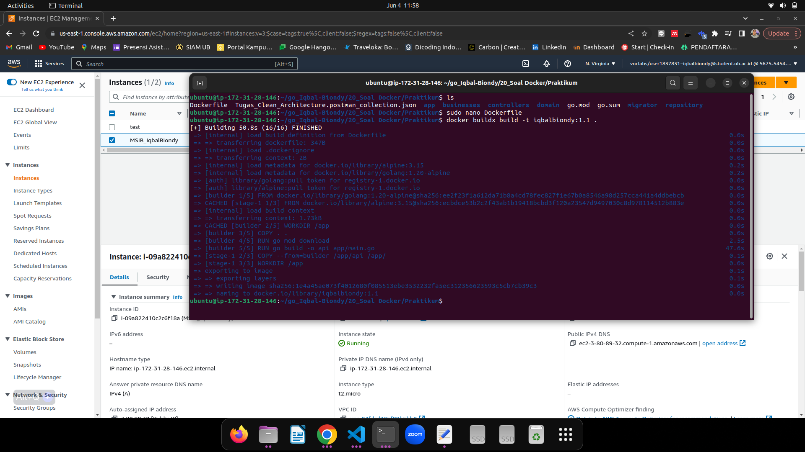

10. melakukan deploymen AWS RDS dengan memilih MySQL sebagai database

    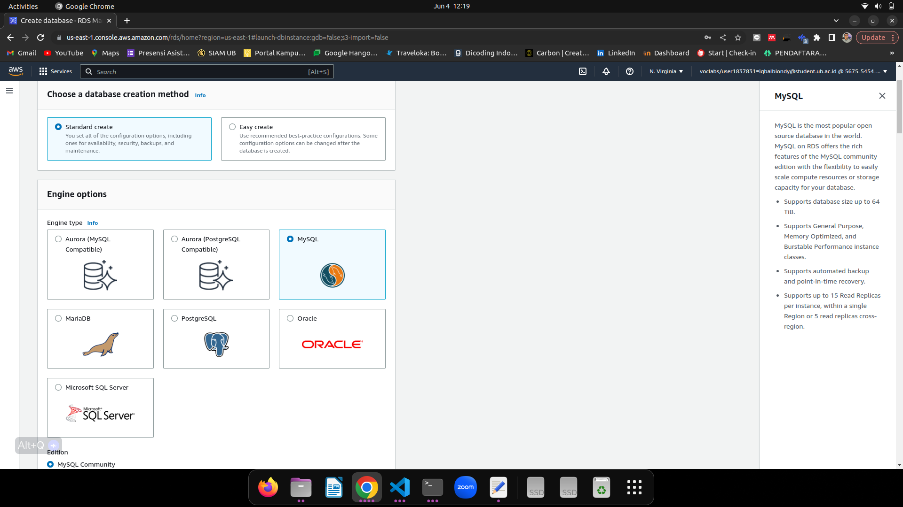

11. melakukan konfigurasi MySQL di AWS RDS

    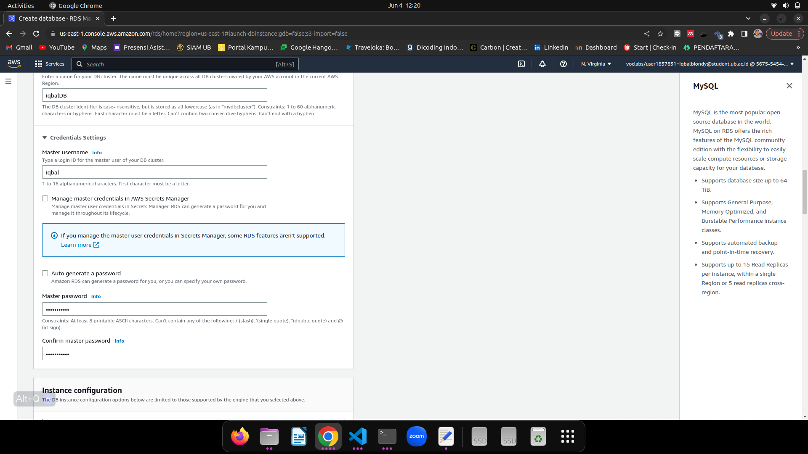

12. AWS RDS MySQL Berhasil dibuat

    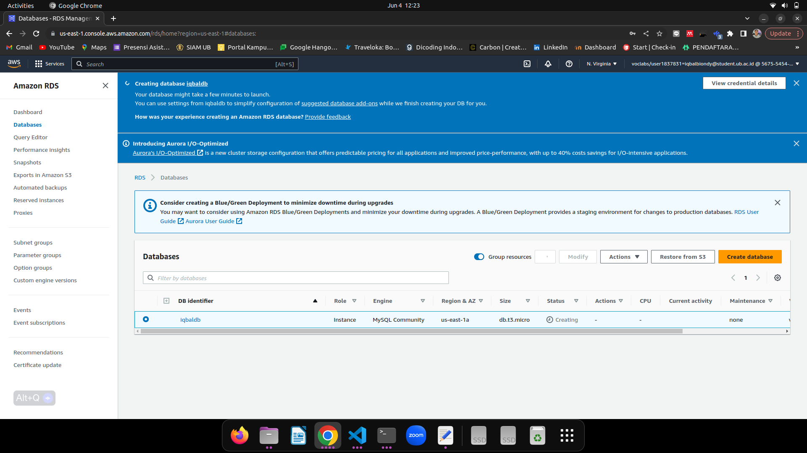

13. melakukan koneksi dari AWS RDS dengan database MySQL ke ubuntu intance EC2

    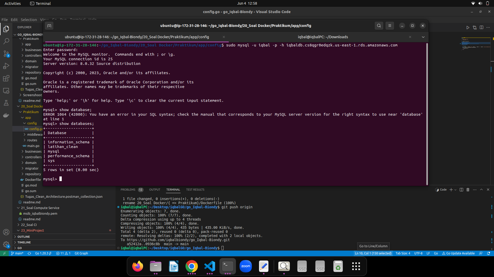

14. Buid, Push _Image Docker_ ke docker hub dan Pull _Image Docker_ dari instance EC2

    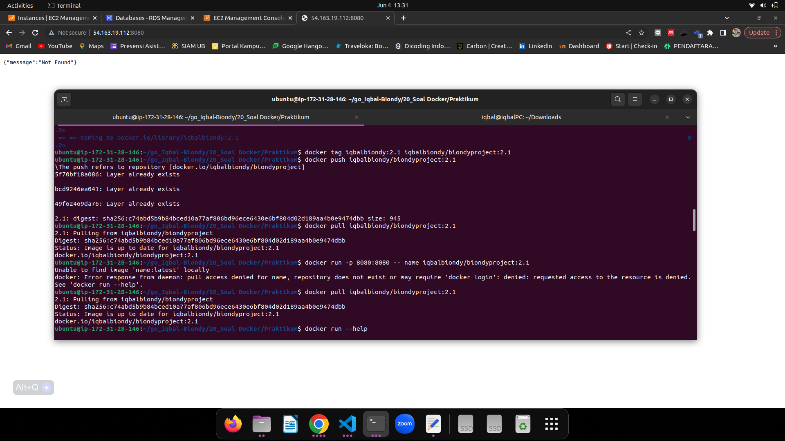

15. melakukan run Docker image

    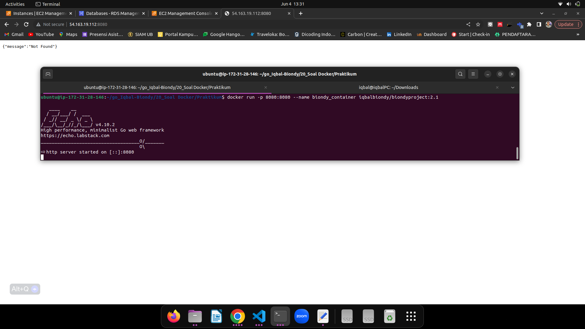

16. mengakses project GO ke postman yang telah berjalan di docker image 

    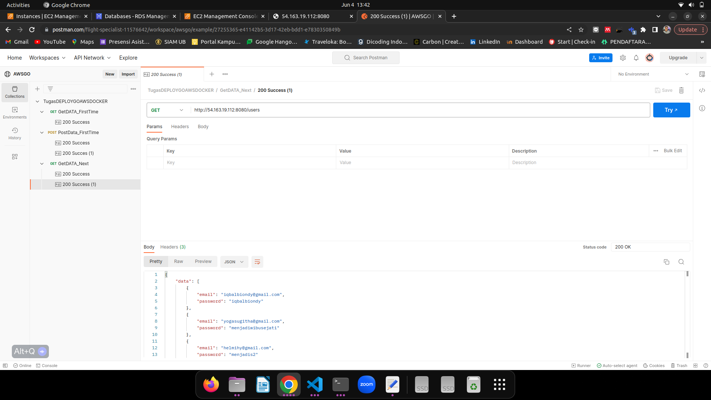

17. menguji inputan data yang telah dimasukkan dari postman dengan melihat langsung isi dari databasenya

    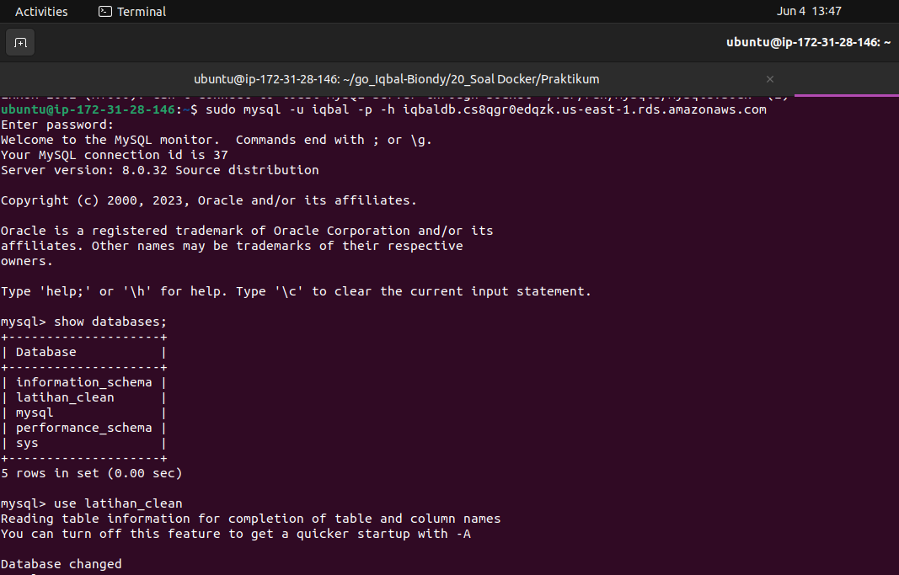
        
