## Resume - Compute Service

---

Berikut adalah beberapa ringkasan materi yang saya buat mengenai Compute Service:

1. Compute Service adalah layanan cloud yang menyediakan kapasitas komputasi untuk menjalankan aplikasi dan beban kerja pada infrastruktur yang dikelola oleh penyedia layanan cloud.

2. Compute Service menyediakan berbagai jenis server virtual yang dapat dikonfigurasi dan dioperasikan secara fleksibel, termasuk virtual private server (VPS), instance EC2 di AWS, atau Compute Engine di GCP.

3. Compute Service memungkinkan pengguna untuk menyesuaikan spesifikasi komputasi seperti jumlah CPU, memori, penyimpanan, jaringan, dan sistem operasi yang digunakan.

4. Compute Service menyediakan mekanisme skalabilitas otomatis, sehingga aplikasi dan beban kerja dapat dijalankan pada infrastruktur yang dapat menyesuaikan diri dengan permintaan.

5. Compute Service menyediakan fitur pengelolaan beban kerja dan otomatisasi yang dapat membantu pengguna dalam menjalankan dan mengelola aplikasi, termasuk pengaturan jadwal, penyeimbangan beban, dan manajemen pemantauan.

6. Compute Service juga menyediakan layanan keamanan seperti firewall, akses jaringan, dan enkripsi data untuk menjaga keamanan beban kerja dan data pengguna.

7. Compute Service memungkinkan pengguna untuk membayar hanya untuk kapasitas yang mereka gunakan, dengan model pembayaran berbasis penggunaan yang fleksibel dan transparan.

8. Compute Service dapat digunakan dalam berbagai konteks, termasuk pengembangan, pengujian, dan produksi, dan dapat diintegrasikan dengan layanan cloud lainnya seperti penyimpanan, database, dan jaringan.

9. Compute Service telah menjadi salah satu layanan paling penting di lingkungan cloud, karena kemampuannya untuk menyediakan kapasitas komputasi yang mudah dikelola dan sangat fleksibel dengan biaya yang terjangkau.

## Praktikum - Docker & AWS Compute Service

---

1.  Melakukan konfigurasi EC2

    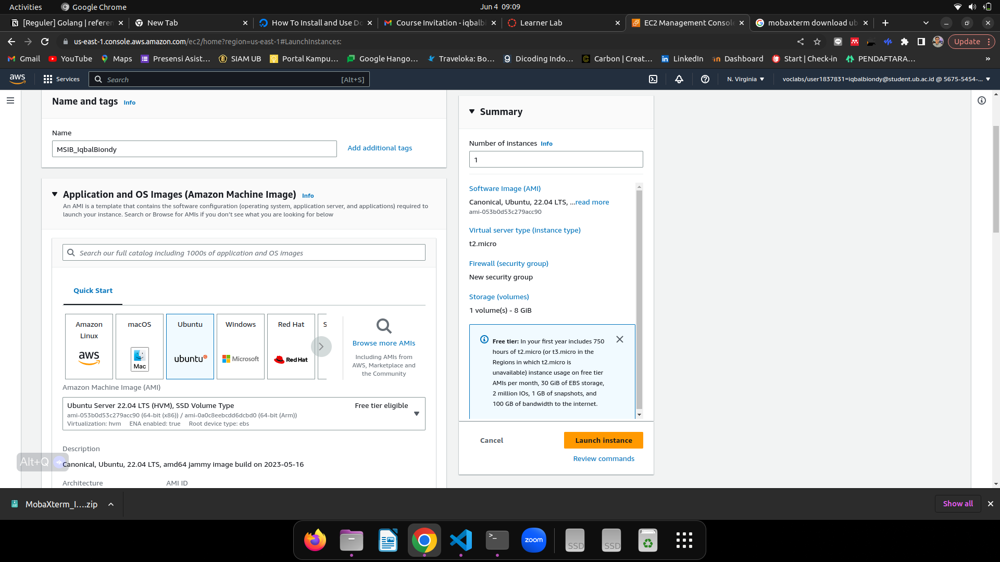

2.  Membuat Create Key Pair

    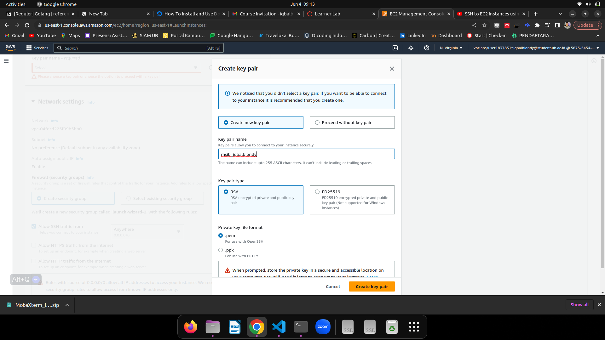

3.  Menyetting Network Setting

    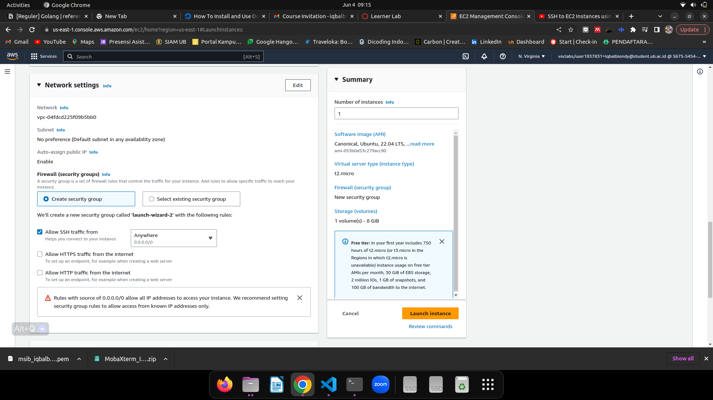

4.  EC2 Instance berhasil dibuat

    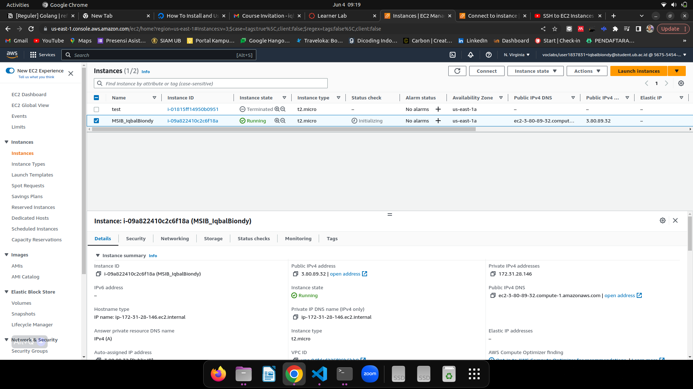

5.  mengkoneksi _instance EC2_ dari lokal komputer

    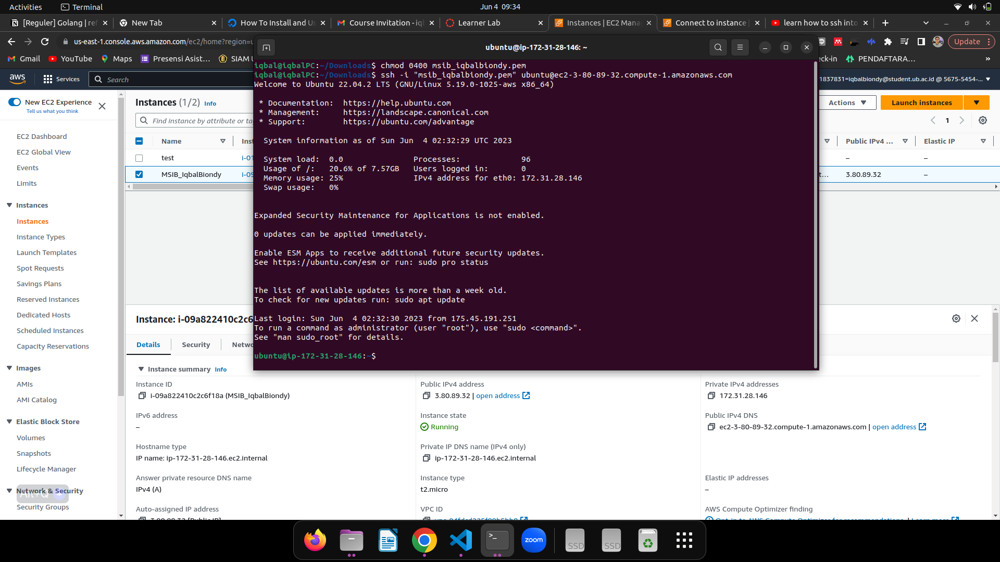

6.  melakukan instalasi docker

    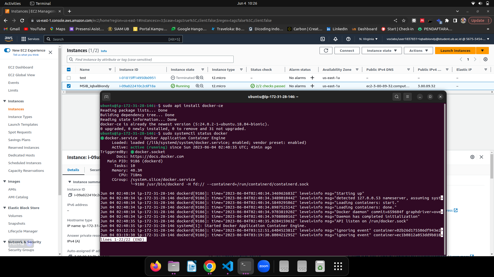

7.  melakukan instalasi & konfigurasi docker compose

    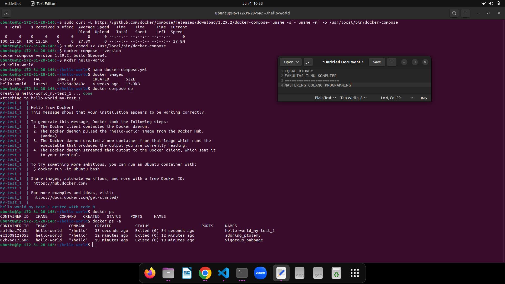

8.  melakukan clonning github ke instance EC2

    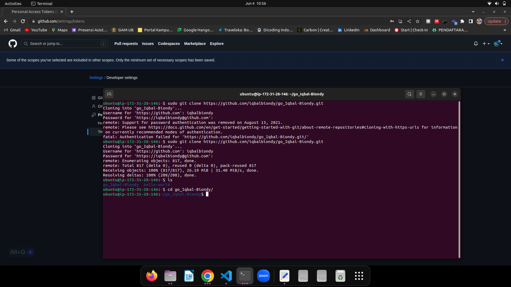

9.  Melakukan Build Docker Image

    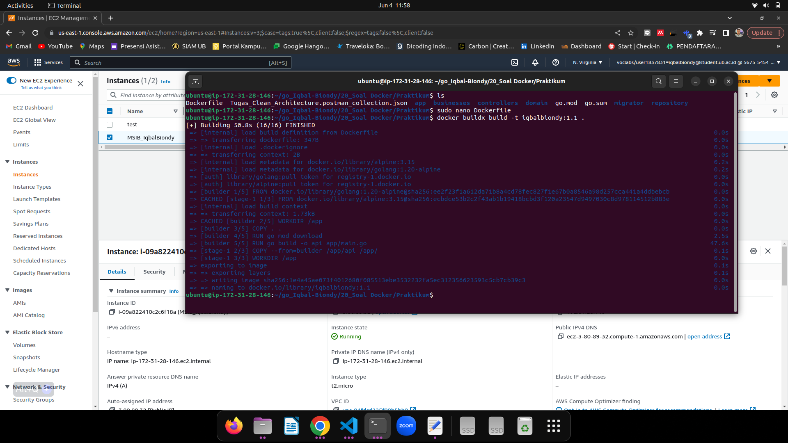

10. melakukan deploymen AWS RDS dengan memilih MySQL sebagai database

    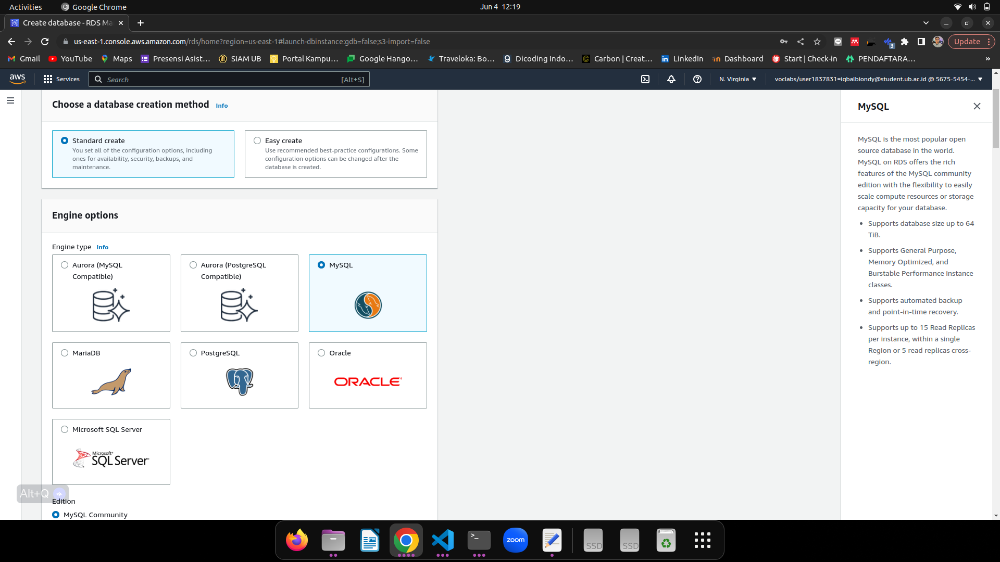

11. melakukan konfigurasi MySQL di AWS RDS

    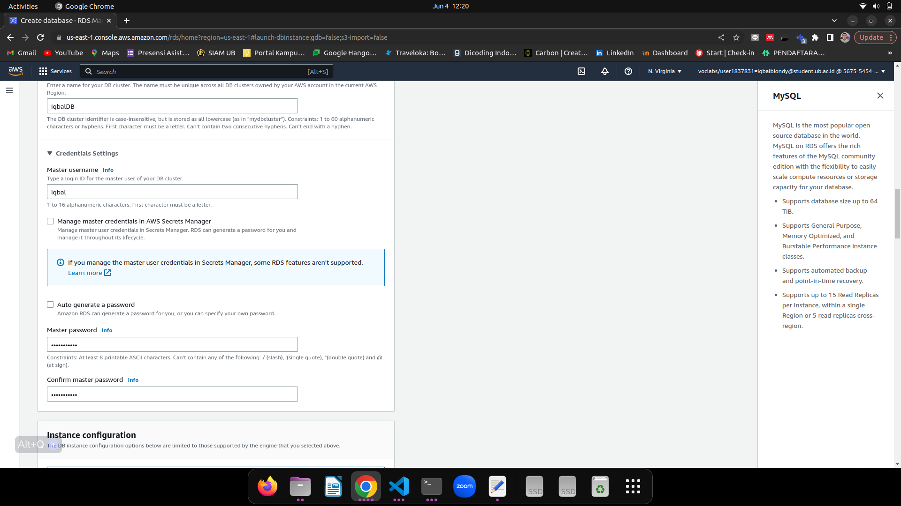

12. AWS RDS MySQL Berhasil dibuat

    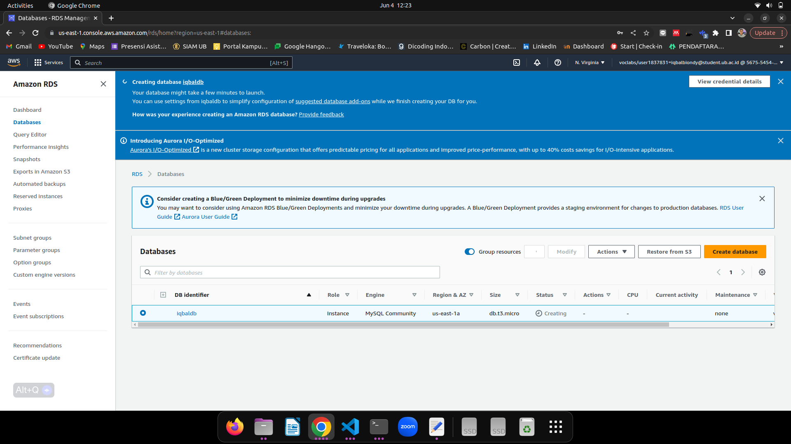

13. melakukan koneksi dari AWS RDS dengan database MySQL ke ubuntu intance EC2

    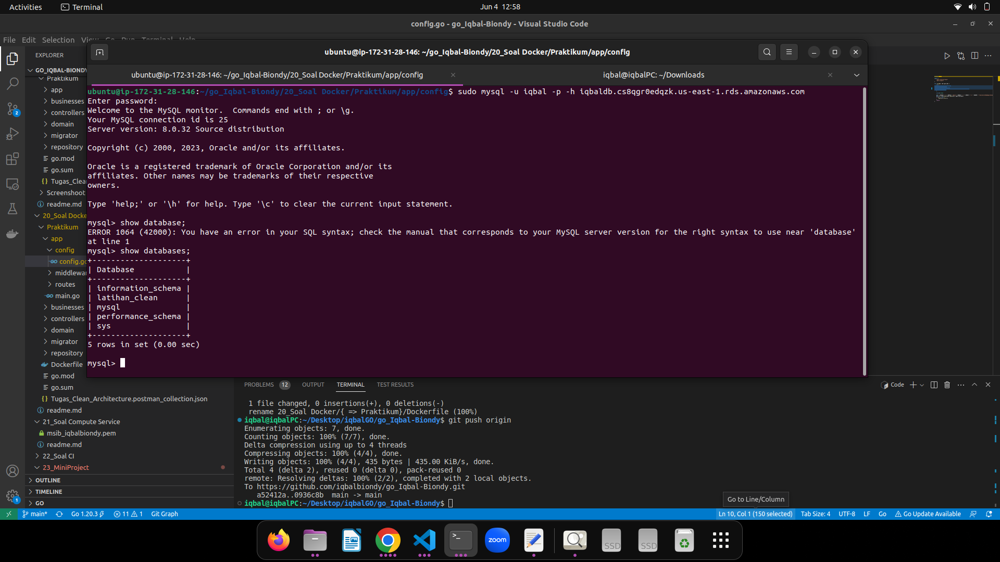

14. Buid, Push _Image Docker_ ke docker hub dan Pull _Image Docker_ dari instance EC2

    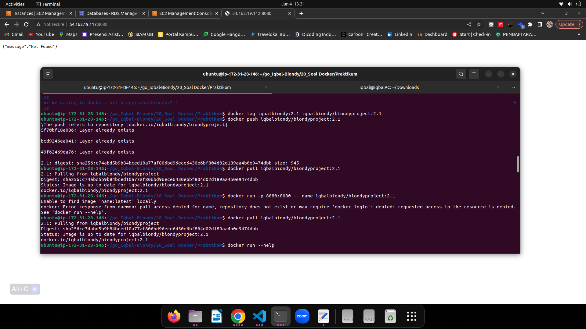

15. melakukan run Docker image

    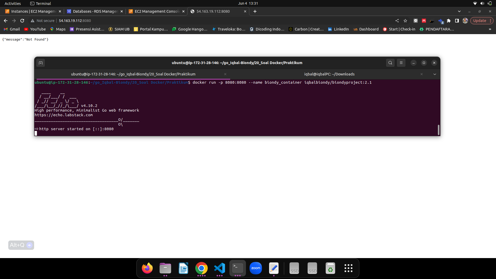

16. mengakses project GO ke postman yang telah berjalan di docker image 

    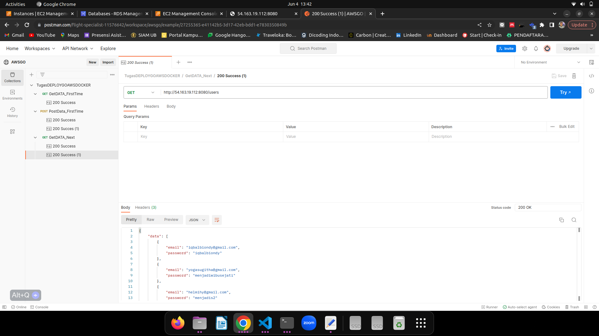

17. menguji inputan data yang telah dimasukkan dari postman dengan melihat langsung isi dari databasenya

    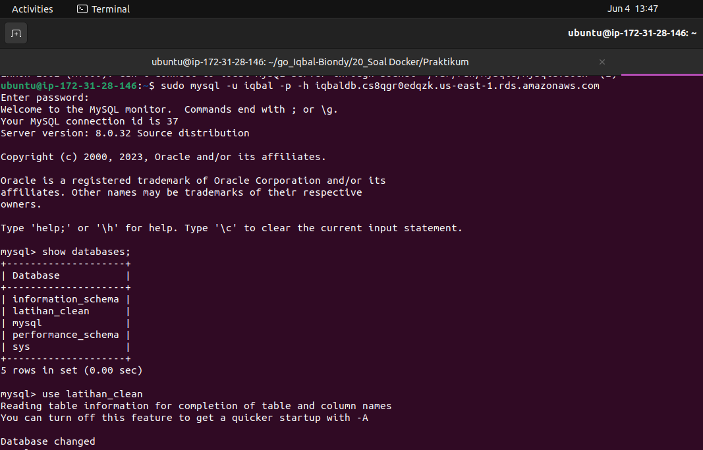
        
